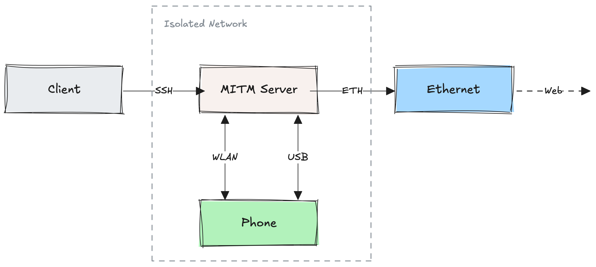
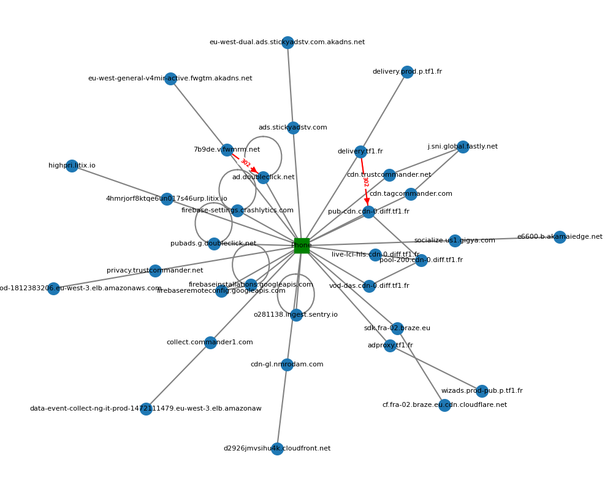

# How to Monitor Android Apps for Compliance: A Practical Example.

## Requirements
- A consumer grade android phone, pre-rooted if you wanna save some time
- A RPI4/5 or anything that can run a linux distro ARM64, with an ethernet and a WiFi interfaces
- At least 64 GB of storage for the server, I recommend 256 GB
- An ethernet cable to connect the server to the network
- A USB-[insert type] cable to connect the phone to the server
- A computer connected to the same network
- A keyboard
- (Optional) A brain
- ChatGPT

  

## Setup

### Grant root priviledges to the phone
- Enter into recovery mode
- Flash [Lineage OS](https://lineageos.org/)
- Flash [Magisk](https://github.com/topjohnwu/Magisk)
- Enable Developer Options
- Enable USB Debugging

### Setup the server (it will act as a man in the middle proxy)
- Debian 12/Ubuntu-Server
- Install Python
- Install ADB
- Install Frida
- Install Fritap

### Turn the server into a WAP (Wireless Accesss Point)
- It must be connected to your network via the ethernet interface (eth0) since we're going to use wlan0 interface as a client
- `sudo apt update && sudo apt install -y hostapd dnsmasq`
- `sudo nano /etc/hostapd/hostapd.conf`
- Add the hotsport configuration:
  ```yaml
  interface=wlan0
  driver=nl80211
  ssid=<HotspotName>
  hw_mode=g
  channel=7
  wmm_enabled=0
  auth_algs=1
  wpa=2
  wpa_passphrase=<SrongPassword8CharMin>
  wpa_key_mgmt=WPA-PSK
  rsn_pairwise=CCMP
  ```
- `sudo nano /etc/default/hostapd` & uncomment `DAEMON_CONF="/etc/hostapd/hostapd.conf"`
- `sudo nano /etc/dnsmasq.conf`
- Add the following:
  ```yaml
  interface=wlan0
  dhcp-range=192.168.4.2,192.168.4.20,255.255.255.0,24h
  dhcp-option=3,192.168.4.1
  dhcp-option=6,8.8.8.8,8.8.4.4
  ```
- `sudo nano /etc/dhcpcd.conf`
- Add the following:
  ```yaml
  interface wlan0
  static ip_address=192.168.4.1/24
  nohook wpa_supplicant
  ```
- Enable ip forwarding with `sudo nano /etc/sysctl.conf` & uncomment `net.ipv4.ip_forward=1`
- `sudo iptables -t nat -A POSTROUTING -o eth0 -j MASQUERADE`
  ```sh
  sudo apt install -y iptables-persistent
  sudo netfilter-persistent save
  sudo netfilter-persistent reload
  ```
  ```sh
  sudo systemctl unmask hostapd
  sudo systemctl enable hostapd
  sudo systemctl start hostapd
  sudo systemctl restart dnsmasq
  ```
- (Optional, if conflict on port :53): `sudo nano /etc/systemd/resolved.conf` & add `DNSStubListener=no`

### Connect the phone to the server
- Connect the phone to the server's WiFi
- Plug it to server with a USB cable
- (Allow any access permissions)
- `adb devices` should print the attached device id
- `adb shell` should ssh to the phone
- `su` inside the shell gives you root priviledges

### Install an APK
- (Optional) Install [apkeep](https://github.com/EFForg/apkeep)
- Downloaod an APK
- Install the APK: `adb install com.example.apk`
- In case the APK is splitted into multiple APKs: `adb install-multiple split-apk1 split-apk2 split-apk3`

## Decrypt HTTPS network traffic
It requires two components:
- Some network traffic (ie: tcpdump pcap file)
- The TLS keys in NSS KL Format

### Capture the network traffic
- Listen to the server's WiFi interface: `tcpdump -i wlan0 -w traffic.pcap`

### Grab the TLS keys in NSS Format
- Download [frida-server Android ARM64](https://github.com/frida/frida/releases) and push it to the device:
  ```sh
  unxz frida-server.xz
  adb root # might be required
  adb push frida-server /data/local/tmp/
  adb shell "chmod 755 /data/local/tmp/frida-server"
  adb shell "/data/local/tmp/frida-server &"
  ```
- Frida will run in background
- Launch any app then run `fritap -m -k ssl_keys.log --enable_spawn_gating [APP_PID] &`
- App's PID can be found with: `adb shell "ps | grep com.machintruc.myapp"`
- Think of Frida as a Tampermonkey/Greasemonkey app. It allows you to inject scripts/extensions/hooks into running apps.
- Fritap provides [hooks to catch TLS keys](https://lolcads.github.io/posts/2022/08/fritap/).

### Decrypt the traffic
- Decrypt traffic: `editcap --inject-secrets tls,ssl_keys.log traffic.pcap decrypted_traffic.pcapng`
- Generate a human readable JSON file `tshark -2 -T ek --enable-protocol communityid -Ndmn -r decrypted_traffic.pcapng > traffic.json`

## Exploratory Data Analysis

### Sample decrypted HTTPS request
- POST https://aax.amazon-adsystem.com/e/msdk/ads
- Vendor: Amazon
- Payload contains device info
- Payload contains consent string under `gdpr c` key

```text
{
  "text": [
    "POST /e/msdk/ads HTTP/1.1\\r\\n",
    "\\r\\n"
  ],
  "_ws_expert": {
    "http_http_chat": null,
    "_ws_expert__ws_expert_message": "POST /e/msdk/ads HTTP/1.1\\r\\n",
    "_ws_expert__ws_expert_severity": "2097152",
    "_ws_expert__ws_expert_group": "33554432"
  },
  "http_http_request_method": "POST",
  "http_http_request_uri": "/e/msdk/ads",
  "http_http_request_version": "HTTP/1.1",
  "http_http_accept": "application/json",
  "http_http_request_line": [
    "Accept: application/json\r\n",
    "content-type: application/json; charset=utf-8\r\n",
    "User-Agent: [redacted]\r\n",
    "Host: aax.amazon-adsystem.com\r\n",
    "Connection: Keep-Alive\r\n",
    "Accept-Encoding: gzip\r\n",
    "Content-Length: 1274\r\n"
  ],
  "http_http_content_type": "application/json; charset=utf-8",
  "http_http_user_agent": "[redacted]",
  "http_http_host": "aax.amazon-adsystem.com",
  "http_http_connection": "Keep-Alive",
  "http_http_accept_encoding": "gzip",
  "http_http_content_length_header": "1274",
  "http_http_content_length": "1274",
  "http_http_request_full_uri": "https://aax.amazon-adsystem.com/e/msdk/ads",
  "http_http_request": true,
  "http_http_request_number": "1",
  "http_http_response_in": "986",
  "http_http_file_data": "{\"dinfo\":{\"os\":\"Android\",\"model\":\"[redacted]":\"aps-
android-9.10.3-GOOGLE_AD_MANAGER\",\"slots\":[{\"sz\":\"320x50\",\"slot\":\"3326843f-fee9-43db-987c-1c3976545d58\",\"slotId\":1,\"supportedMediaTypes\":[\"DISPLAY\"]}],\"appId\":\"5b1d115e-3439-44af-9b0d-
25a8e571b21a\",\"pj\":{\"autoRefresh\":\"false\",\"mediationName\":\"GOOGLE_AD_MANAGER\",\"fwk\":\"native\"},\"isDTBMobile\":\"true\",\"ua\":\"Mozilla\\/5.0 ([redacted]; wv) AppleWebKit\\/537.36
(KHTML, like Gecko) Version\\/4.0 Chrome\\/132.0.6834.122 Mobile
Safari\\/537.36\",\"pkg\":{\"lbl\":\"leboncoin\",\"pn\":\"fr.leboncoin\",\"v\":\"100039100\",\"vn\":\"100.39.1\"},\"gdpr\":{\"c\":\"CQMZ9MAQMZ9MAAHABAFRBbFoAPLgAELgAAAAJoNB_G_dTSFi8X51YPtgcQ1P4VAjogAABgaJAwwBiBLAMIwEhmAIIADqACACABAAICRAAQ
BlCADAAAAAYIAAASAMAAAAIRAIIiAAAEAAAmJICABJC4AAAQAQgkgAABUAgAIAABogSFAAAAAAFAAAAAAAAAAAAAAAAAAAQAAAAAAAAgAAAAAACAAAEAAEAFAAAAAAAAAAAAAAAAAMELwATDQqIACwJCQg0DCAAACoIAgAgAAAAAJAwQAABAgAEAYACjAAAAAFAAAAAAAAABAAAAAAgAQgAAAAIEAAAAAEAAAAEAgEABAA
AAAAABAAAAAEAMAAAIAAgAAAAAoAQAAAAAgAJCgAAAAAAgAAAAAAAAAAEAAAAAAAAAAAAAAAAQAAAAAABADFAAYAAgrKMAAwABBWUgABgACCsoA\",\"e\":1}}"
}
```

### Can we show relationships between hosts?

In a desktop web environment, generating a piggybacking graph based on requests is quite easy since the browser provides context about the initiators, thanks to the Chrome Devtool Protocol for instance.
However, it's much more challenging in a mobile environment:
- Mobile networking is more opaque.
- Webviews, native APIs, background services etc. make it harder to correlate requests

Yet, there are techniques to trace these requests. One approach is to analyze redirects (302) and the subsequent locations the device is instructed to request. Another method involves tracking specific request parameters (e.g., user_id=XYZ) within payloads to identify relationships between requests.

In the below schema, we can clearly highlight the relationships between the hosts via the `Location` header for 302 requests.




## Static analysis
- Besides dynamic analysis that shows active threats, we can do some static analysis to identify the landscape of possible threats
- One common practice is to analyse .dex files from an unzipped APK
- `dexdump com.example.apk | grep "Class"`
- Leverage LLMs to classify hosts from installed packages
- Also, is great to check for "requestable" permissions by parsing the AndroidApplication.xml file

## Challenges
- Root detection by apps (banking apps...)
- SSL pinning
- Not all TLS libs supported
- Piggybacking???
- With some LLMs engineering, we could easily classify hosts and detect possible trackers (fingerprinting, geo data, device info...)
- We can also create custom frida hooks to hook Java methods such as permission requests
